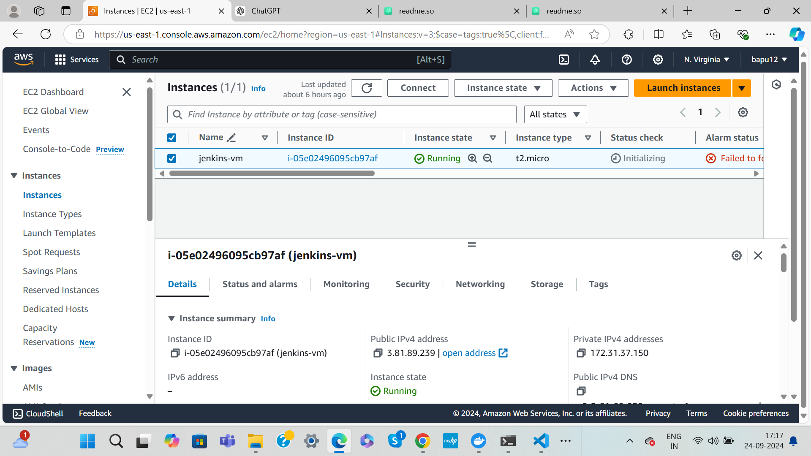
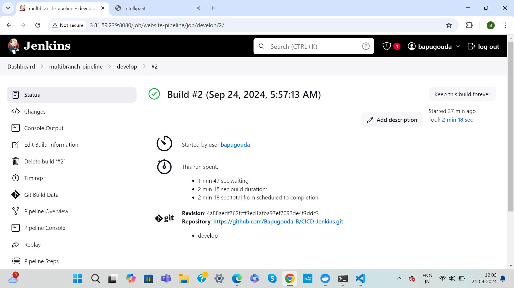
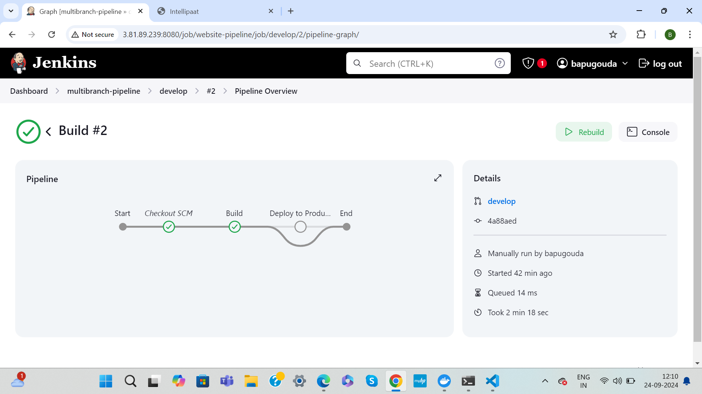
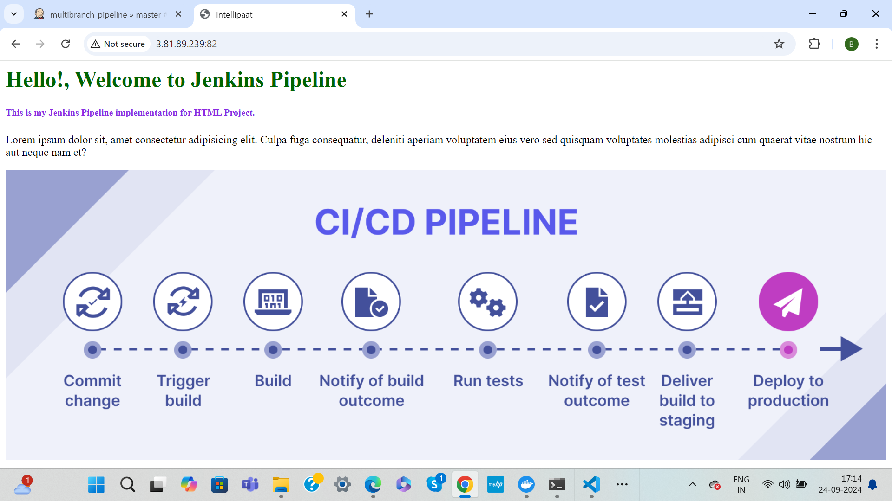

# Integration of CICD with Jenkins

This project demonstrates the implementation of a CI/CD pipeline using GitHub, Docker, and Git Workflow. The pipeline builds and deploys a website based on the branch where changes are committed.

## Table of Contents
- [Prerequisites](#prerequisites)
- [Git Workflow](#git-workflow)
- [CI/CD Pipeline Workflow](#cicd-pipeline-workflow)
- [Docker Configuration](#docker-configuration)
- [Steps to Implement](#steps-to-implement)
- [Project Screenshots](#project-screenshots)

## Prerequisites
- GitHub repository with product code (link: [GitHub Repo](https://github.com/Bapugouda-B/CICD-Jenkins))
- Docker installed
- Git installed
- Jenkins 
- Basic understanding of Git Workflow

## Git Workflow
- **Develop Branch**: The default branch for development.
- **Master Branch**: The main branch for production releases.
- Commits made to the `develop` branch will trigger the build process only.
- Commits made to the `master` branch will trigger the build and publish the website on port 82.

## CI/CD Pipeline Workflow
1. **Code Push**: Whenever code is pushed to the `master` or `develop` branch:
   - **Develop Branch**: Triggers a build without publishing.
   - **Master Branch**: Triggers a build and publishes the website.
   
2. **Docker Setup**: The project is built and deployed inside a Docker container using an Ubuntu image with Apache installed.
   
3. **Triggering the Pipeline**: The CI/CD tool monitors the branches and automatically triggers the pipeline based on the branch.

## Docker Configuration
- The Docker container is configured to install Apache, build the website, and publish the content to `/var/www/html`.
  
**Dockerfile**:
```dockerfile
# Use Ubuntu as the base image
FROM ubuntu:latest

# Install Apache
RUN apt-get update && \
    apt-get install -y apache2 && \
    apt-get clean

# Copy website code to Apache's default location
COPY . /var/www/html/

# Expose port 82 for the website
EXPOSE 82

# Start Apache
CMD ["/usr/sbin/apache2ctl", "-D", "FOREGROUND"]
```

## Steps to Implement


### Table of Contents
1. [Create AWS EC2 Instance](#1-create-aws-ec2-instance)
2. [Connect to EC2 Instance](#2-connect-to-ec2-instance)
3. [Install Docker on EC2](#3-install-docker-on-ec2)
4. [Set Up Dockerfile and Application](#4-set-up-dockerfile-and-application)
5. [Build and Run the Docker Container](#5-build-and-run-the-docker-container)
6. [Set Up Security Group for Port 82](#6-set-up-security-group-for-port-82)
7. [Access Application via Browser](#7-access-application-via-browser)

---

### 1. Create AWS EC2 Instance

1. Login to AWS Management Console.
2. Navigate to **EC2 Dashboard** and click **Launch Instance**.
3. Select an AMI (Amazon Machine Image), preferably **Ubuntu Server 20.04 LTS**.
4. Choose an instance type, e.g., **t2.micro** (free-tier eligible).
5. Configure the instance, keep defaults for **Network** settings.
6. Add **Storage** (keep default or add as per your requirement).
7. Configure **Security Group** to allow HTTP traffic:
   - Type: **HTTP**
   - Protocol: **TCP**
   - Port Range: **80**
   - Source: **Anywhere (0.0.0.0/0)**

8. Launch the instance, and download the private key (.pem) file. This will be used to SSH into the instance.

### 2. Connect to EC2 Instance

1. Open terminal and use the following command to SSH into the instance:

   ```bash
   chmod 400 <path-to-your-key.pem>
   ssh -i <path-to-your-key.pem> ubuntu@<ec2-public-ip>

### 3.  Install Docker on EC2

1. Once you are connected to the EC2 instance, install Docker using the following commands:
    
    ```bash
    # Update packages
    sudo apt-get update

    # Install Docker
    sudo apt-get install -y docker.io

    # Start and enable Docker
    sudo systemctl start docker
    sudo systemctl enable docker

    # Add user to docker group so you can run Docker without sudo
    sudo usermod -aG docker $USER

### 4. Set Up Dockerfile and Application

1. Clone the GitHub repository to your EC2 instance:
 
 ```bash
 git clone <repository-url> cd <project-repo-name> 
 ```
 
2. Create a Dockerfile inside the cloned repository directory:

```bash 
vi Dockerfile
```
Insert this in Dockerfile
```bash 
# Use Ubuntu as the base image
FROM ubuntu:latest

# Install Apache
RUN apt-get update && \
    apt-get install -y apache2 && \
    apt-get clean

# Copy website code to Apache's default location
COPY . /var/www/html/

# Expose port 82 for the website
EXPOSE 82

# Start Apache
CMD ["/usr/sbin/apache2ctl", "-D", "FOREGROUND"]
```

### 5. Build and Run the Docker Container
1. Build the Docker image
```bash
docker build -t my-website .
```
2. Run the Docker container and expose it on port 82
```bash
docker run -d -p 82:80 my-website
```
3. Confirm that the container is running
docker ps
```bash
docker ps
```
### 6. Set Up Security Group for Port 82
1. Navigate back to the EC2 Dashboard on AWS.
2. Select your instance and click Security > Security Groups.
3. Edit the Inbound rules of the security group to add the following rule:
    - Type: Custom TCP Rule
    - Port Range: 82
    - Source: Anywhere (0.0.0.0/0)

### 7. Access Application via Browser
```bash
http://<ec2-public-ip>:82
```
If everything is set up correctly, you should see the website running from the Docker container on your EC2 instance

## Project Screenshots








